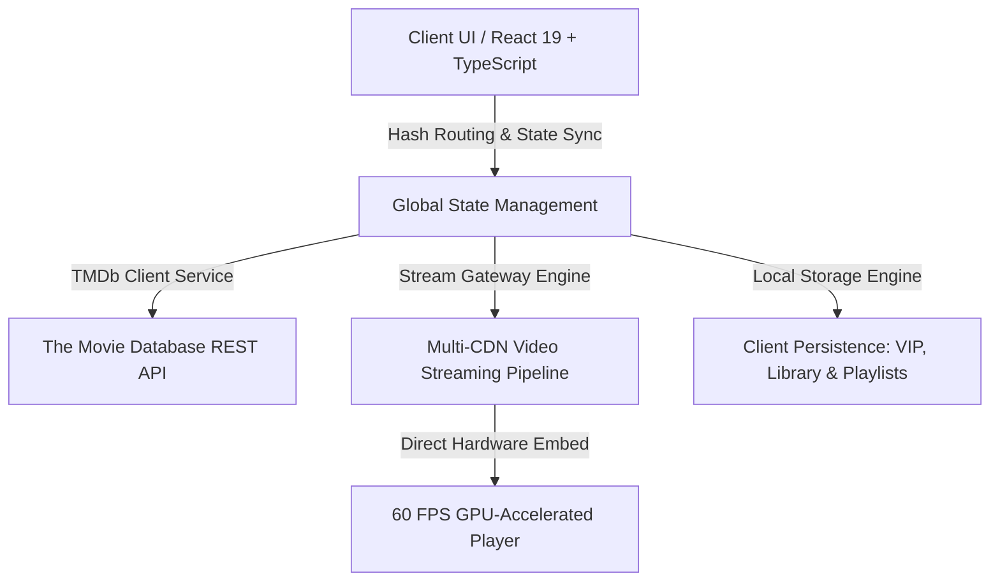

# 🎬 RuangSinema — Modern Indonesian & Asian Cinema Streaming Platform

[](https://react.dev/)
[](https://www.typescriptlang.org/)
[](https://tailwindcss.com/)
[](https://vitejs.dev/)
[](https://www.themoviedb.org/)
[](LICENSE)

**RuangSinema** adalah platform streaming film, drama Korea (Drakor), drama China (Dracin), dorama Jepang, anime, dan film bioskop Indonesia terlengkap berbasis web modern dan aplikasi Android native. Dirancang dengan antarmuka sinematik kelas premium (*IDLIX & Netflix architecture*), pemutar video berkecepatan tinggi multi-server 60 FPS, serta integrasi penuh basis data TMDb.

---

## 🏛️ Fundamental & Arsitektur Sistem (Core Engineering Fundamentals)

RuangSinema dibangun dengan prinsip rekayasa perangkat lunak modern untuk menjamin performa tinggi, keandalan data, dan pengalaman pengguna (*UX*) yang responsif tanpa lag:



### 1. Reaktif & Sinkronisasi State (Reactive State & Hash Routing)
- **Zero-Reload SPA Navigation**: Perpindahan layar antara *Home, Detail, Eksplorasi, Koleksi, dan Profil* berjalan instan tanpa memuat ulang halaman (*zero page-refresh*).
- **Synchronized Hash Routing**: Setiap judul film dan episode memiliki URL unik berbasis hash (contoh: `#tv-294095` atau `#movie-12345`), mendukung tombol *Back/Forward* browser secara sempurna.
- **Dual-Tier State Synchronization**: Kategori yang dipilih pada navbar (*Drakor, Dracin, Film Indo, Movies, dll*) otomatis tersinkronisasi 100% dengan mesin filter katalog dan indikator visual aktif menyala merah (*Crimson Glow*).

### 2. Multi-Server Streaming Gateway & Failover
- **Smart Failover System**: Aplikasi menyediakan 6 gateway server independen. Jika satu server mengalami latensi tinggi, pengguna dapat beralih ke server cadangan dalam 1-klik tanpa kehilangan posisi tontonan.
- **Automatic Subtitle Injection**: Server 1 VIP secara otomatis mengintegrasikan subtitel Bahasa Indonesia resmi.
- **Direct GPU Compositing**: Pemutar video dioptimalkan dengan akselerasi perangkat keras langsung ke chip GPU untuk menjamin kelancaran 60 FPS tanpa *frame-drop* (*anti-lag / anti-stuttering*).

### 3. Manajemen Data & Caching Hybrid
- **TMDb Data Layer**: Layanan data modular dengan normalisasi otomatis untuk konten film (*Movie*) dan serial TV (*Series*).
- **Client Persistence**: Riwayat tontonan, progres menit terakhir, daftar tonton (*watchlist*), dan playlist kustom tersimpan secara aman di *Local Storage* per akun pengguna.

### 4. Portal Rendering & Accessibility (A11y)
- **React Portal Modals**: Seluruh jendela pop-up (seperti pop-up filmografi artis dan konfirmasi hapus koleksi) dirender menggunakan `createPortal` langsung ke root `document.body`, menghilangkan bug pergeseran posisi kontainer CSS dan memastikan modal selalu muncul tepat di tengah layar pengguna.

---

## 🌟 Fitur Utama (Key Features)

- 🎥 **Embedded In-Page Cinema Player**: Pemutar video 16:9 sinematik yang terintegrasi langsung di halaman tanpa modal pop-up mengambang yang canggung, dengan auto-scroll dan kontrol server otomatis.
- ⚡ **6 Server Streaming Cepat (Sub Indo HD 60 FPS)**:
  - *Server 1 VIP* (MultiEmbed Sub Indo Auto-Connect)
  - *Server 2* (VidLink Ultra Fast)
  - *Server 3* (Vidsrc Pro HD)
  - *Server 4* (Moviee 1080p)
  - *Server 5* (SmashyStream)
  - *Server 6* (EmbedSu)
- 🇰🇷 **Katalog Drama Korea (Drakor) 100+ Judul**: Koleksi Drakor terlengkap mencakup *A Bona Fide Killer*, *Squid Game*, *Queen of Tears*, *Hospital Playlist*, *Moving*, *Twinkling Watermelon*, dan puluhan judul lainnya lengkap dengan pemilihan Season & Episode instan.
- 🇮🇩 **Koleksi Film Bioskop Indonesia Terlengkap**: *Janji Joni*, *The Raid 1 & 2*, *Pengabdi Setan*, *The Night Comes For Us*, *Agak Laen*, *Laskar Pelangi*, *Ada Apa Dengan Cinta?*, dan ratusan film lokal berkualitas HD.
- 🇨🇳 **Drama China (Dracin) & Dorama Jepang**: Ribuan serial romansa, wuxia, fantasi sejarah, dan anime populer Jepang (*Demon Slayer*, *Jujutsu Kaisen*, *Solo Leveling*, dll).
- 🧭 **Dual-Tier Responsive Navbar**: Bilah navigasi dua tingkat dengan 9 kategori utama (*Home, Movies, TV Series, Film Indo, Drakor, Dracin, Anime, Collections, Genres*) yang selalu menyala aktif merah sinematik (*Crimson Glow*) sesuai halaman yang dibuka.
- 🎭 **Pop-Up Profil & Filmografi Artis Lengkap**: Jendela pop-up profil aktor dengan foto asli berkualitas tinggi, biodata kelahiran, riwayat karir, serta galeri filmografi geser samping (*horizontal smooth scroll*).
- 📚 **Daftar Koleksi & Playlist Kustom**: Fitur simpan judul favorit dan buat playlist kustom dengan sistem konfirmasi hapus interaktif (*Delete Confirmation Modal*).
- 📱 **Universal Android APK Synchronization**: Integrasi langsung dengan aplikasi mobile Android Flutter yang mendukung akselerasi GPU 60 FPS.

---

## 📡 Informasi & Integrasi API (API Documentation)

RuangSinema mengintegrasikan **The Movie Database (TMDb) REST API v3** dan **MultiEmbed Streaming Provider Gateway** untuk menyajikan metadata sinema akurat, poster resolusi tinggi, dan tautan streaming video.

### 1. TMDb (The Movie Database) API Architecture
- **Base URL**: `https://api.themoviedb.org/3`
- **Image Base URL**: `https://image.tmdb.org/t/p/w500` (Poster) & `https://image.tmdb.org/t/p/original` (Backdrop Banner)

#### Endpoint yang Digunakan:

| Kategori | Endpoint TMDb | Keterangan |
|---|---|---|
| **Film Indonesia** | `GET /discover/movie?with_original_language=id&sort_by=popularity.desc` | Mengambil katalog film bioskop Indonesia |
| **Drama Korea (Drakor)** | `GET /discover/tv?with_original_language=ko&sort_by=popularity.desc` | Mengambil serial drama Korea terpopuler |
| **Drama China (Dracin)** | `GET /discover/tv?with_original_language=zh&sort_by=popularity.desc` | Mengambil drama China & wuxia |
| **Anime Jepang** | `GET /discover/tv?with_original_language=ja&with_genres=16` | Mengambil serial animasi Jepang |
| **Detail Film** | `GET /movie/{id}?append_to_response=credits,videos,similar` | Metadata lengkap, pemeran, dan trailer film |
| **Detail Serial TV** | `GET /tv/{id}?append_to_response=credits,videos,similar` | Metadata serial TV, season, dan episode |
| **Episode Season** | `GET /tv/{id}/season/{season_number}` | Daftar episode per season berserta sinopsis |
| **Profil & Filmografi Aktor** | `GET /person/{id}?append_to_response=combined_credits` | Biodata artis dan seluruh film yang dibintangi |
| **Pencarian Multi** | `GET /search/multi?query={query}` | Pencarian global film, serial, dan aktor |

### 2. Multi-Server Video Streaming Integration
Tautan pemutar video dihasilkan secara dinamis menggunakan ID TMDb resmi:
- **Server 1 (MultiEmbed VIP Sub Indo)**:
  - Film: `https://multiembed.mov/directstream.php?video_id={tmdb_id}&tmdb=1`
  - Serial: `https://multiembed.mov/directstream.php?video_id={tmdb_id}&tmdb=1&s={season}&e={episode}`
- **Server 2 (VidLink Ultra Fast)**:
  - Film: `https://vidlink.pro/movie/{tmdb_id}`
  - Serial: `https://vidlink.pro/tv/{tmdb_id}/{season}/{episode}`
- **Server 3 (Vidsrc Pro)**:
  - Film: `https://vidsrc.vip/embed/movie/{tmdb_id}`
  - Serial: `https://vidsrc.vip/embed/tv/{tmdb_id}/{season}/{episode}`

---

## 🛠️ Tech Stack & Arsitektur

- **Frontend Framework**: [React 19](https://react.dev/) + [Vite](https://vitejs.dev/)
- **Bahasa Pemrograman**: [TypeScript](https://www.typescriptlang.org/)
- **Styling & UI**: [Tailwind CSS v3.4](https://tailwindcss.com/)
- **Icons**: [Lucide React](https://lucide.dev/)
- **State Management & Navigation**: React Hook Architecture with synchronized URL hash routing
- **Mobile Engine**: Flutter 3.x (Universal Android APK)

---

## 🚀 Panduan Memulai (Getting Started)

### Prasyarat:
- [Node.js](https://nodejs.org/) (versi 18.0 atau lebih baru)
- NPM atau Yarn

### 1. Kloning Repository:
```bash
git clone https://github.com/Alfianax01/RuangSinema.git
cd RuangSinema
```

### 2. Install Dependensi:
```bash
npm install
```

### 3. Jalankan Development Server:
```bash
npm run dev
```
Buka browser di `http://localhost:5173`.

### 4. Build untuk Production:
```bash
npm run build
```
File hasil kompilasi siap rilis akan berada di folder `/dist`.

---

## 📂 Struktur Direktori Proyek

```plaintext
bioskopku-web/
├── public/                # Asset statis, favicon, logo, APK installer
├── src/
│   ├── components/        # Komponen UI (Navbar, MovieCard, ActorModal, DownloadModal, dll)
│   ├── pages/             # Layar utama (HomeScreen, DetailScreen, DiscoverScreen, LibraryScreen, dll)
│   ├── services/          # Integrasi API TMDb & logika streaming multi-server
│   ├── types/             # Deklarasi tipe data TypeScript (Movie, Actor, Season, Playlist)
│   ├── App.tsx            # Komponen root & routing state global
│   ├── main.tsx           # Entry point aplikasi React
│   └── index.css          # Styling Tailwind & animasi global
├── index.html             # HTML template
├── package.json           # Dependensi & script proyek
├── tailwind.config.js     # Konfigurasi tema Tailwind CSS
├── tsconfig.json          # Konfigurasi TypeScript
└── vite.config.ts         # Konfigurasi Vite bundler
```

---

## 📄 Lisensi (License)

Proyek ini dilisensikan di bawah lisensi **MIT License** — silakan gunakan dan kembangkan untuk keperluan pembelajaran maupun non-komersial.

---

<p align="center">
  Dibuat dengan ❤️ untuk pecinta sinema Indonesia & Asia.
</p>
